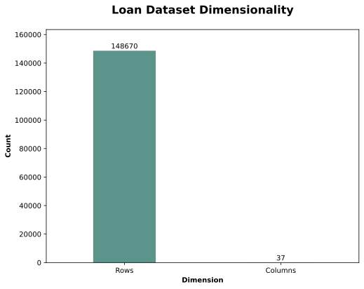
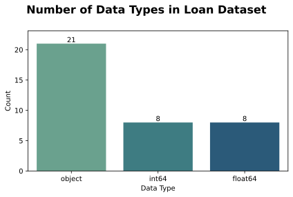
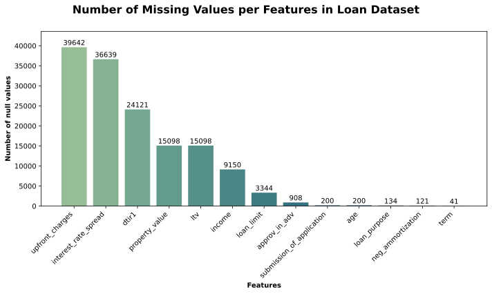
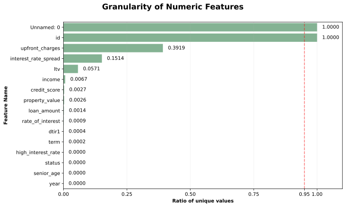
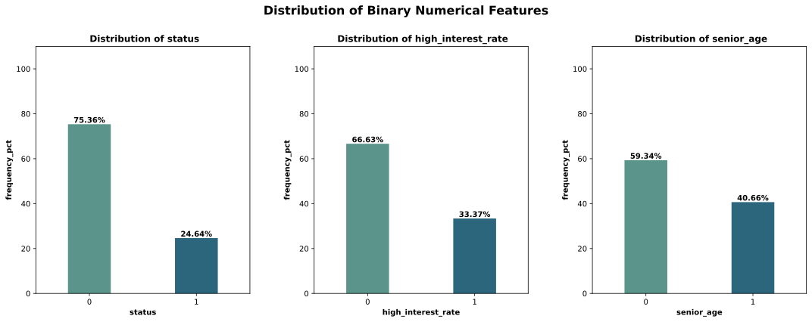
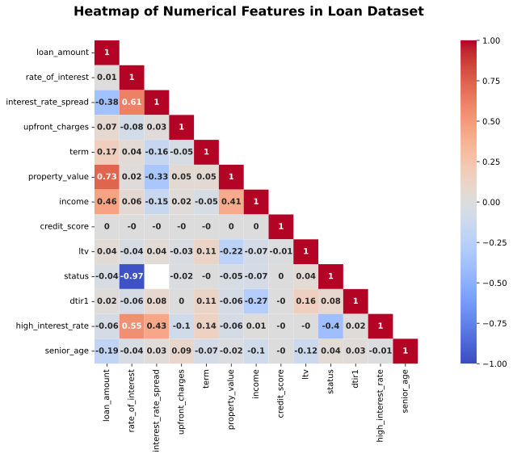

# 1. Purpose & Scope
This document records all data cleaning, validation and transformation decisions made during the analysis. The goal is to ensure transparency, reproductability, and defensibility of the modeling process.

# 2. Exploratory Data Analysis (EDA)
Source: German banking data from 2019 [Link](https://www.kaggle.com/datasets/ychope/loan-approval-dataset/data) 
Domain: Loan approval/Credit risk  
Target variable: status  

## 2.1 Feature Glossary
**Loan & Application Characteristics**
- loan_limit: Indicates whether the loan amount falls within conforming loan limits or exceeds regulatory thresholds
- approv_in_adv: Whether the Loan has been approved in advance, before formal application submission
- loan_type: Type of loan 
- loan_purpose: Purpose of Loan e.g. home purchase, refinancing
- submission_of_application: The channel through which the loan application was submitted (e.g., online, broker, branch)
- year: Calendar year when the loan was accepted or rejected

**Applicant's profile**
- Unnamed: 0 : Anonimized applicant's name
- id: Loan applicant ID
- gender: Gender of loan applicant
- age: Age category of the applicant
- income: Annual income of loan applicant
- senior_age: Indicates whether the applicant falls into a senior age group
- region: Geographic region of loan applicant

**Credit History**
- credit_worthiness: Categorical assessment of the applicant’s overall credit risk profile
- open_credit: Indicates whether the applicant has open lines of credit at the time of application
- co-applicant_credit_type: Credit history classification of the co-applicant, if present
- credit_type: Type of credit history or bureau record associated with the applicant
- credit_score: Applicant's credit score, summarizing the applicant’s creditworthiness

**Loan & Payment Structure**
- loan_amount: Loan amount
- rate_of_interest: Loan interest rate (If approved. NaN if the loan is not approved)
- interest_rate_spread: Difference between the loan’s interest rate and a benchmark reference rate
- term: Duration of the loan repayment period, measured in months
- neg_ammortization: Indicator of whether the loan allows negative amortization
- interest_only: Specifies whether the loan permits interest-only payments for an initial period
- lump_sum_payment: Indicates whether a lump-sum or balloon payment is required at maturity
- high_interest_rate: Flag identifying loans with interest rates above a predefined threshold

**Fees**
- upfront_charges: Fees charged at loan origination, including processing or administrative costs

**Property & Collateral Information**
- property_value: Appraised or estimated value of the collateral property
- ltv: Ratio of the loan amount to the property value, a key risk metric
- construction_type: Classification of the property’s construction 
- occupancy_type: Indicates whether the property is owner-occupied, rented, or secondary residence
- secured_by: Type of asset used to secure the loan
- security_type: Classification of the collateral or lien structure securing the loan
- total_units: Number of residential units associated with the property

**Business & Usage**
- business_or_commercial: Business loan or commercial loan

**Debt &Affordability Indicators**
- dtir1: Ratio of total debt obligations to income

**Target Variable**
- status: Loan outcome indicating approval or rejection

## 2.2 Data Characteristics
 ### 2.2.1 Data Dimensionality
The dataset constitutes of 148670 rows and 37 columns. Each row indicates one observation whose properties are described by 37 different features in the dataset. See the dimensionality below. 

    

### 2.2.2 Data Types
The dataset contains different data types. The types are representing intiger, float and object type data. 
The intiger and float types are so-called numerical features, while the object type can be interpreted as categorial features.
Due to the different data types, it is identified as heterogenous dataset.
See the number of data types below.

    

### 2.2.3 Missing Values
13 features contain missing values.
upfront_charges and interest_rate_spread are the dominant ones up to nearly 40k missing values. 
A suspicious phenomenon can be observed among pairs of features.
- The number of missing values among upfront_charges and interest_rate_spread is closely equal.
- The number of missing values among property_value and ltv is equal.

This phenomenon might derive from strong relationship among these feature groups. It requires further statistical examination.
See the number of missing values below.

    

## 2.3 Properties of Numerical Features

### 2.3.1 Data Granularity (uniqueness) 
The plot below shows the granularity (the uniqueness) of numerical features expressed in ratios.
Higher the ratio, higher the number of unique values in the given feature.
Features with ratio close to 1.0 imply unique identifiers in the dataset, rahter than informative/predictive features
Features  'Unnamed:0', 'id' and 'year'  do not bring any valuable information to the model hence can be removed from further analysis

    

### 2.3.2 Univariate Analysis

    

 
 
 
 
The features 'status', 'high_interest_rate', 'senior_age' are binary features as the value set is [0;1].
As a result, cardinality is 2 of these features.
The plot depicts the cardinality and the frequency to illustrate the imbalancement.
It is particularly important for the target variable as its imbalancement can negatively impact the model's training.   

- Value 1 in 'status' is very under represented
- Value 1 in 'high_interest_rate' is very under represted
- Value 1 in 'senior_age' is under represented

These have to be taken into consideration at the time of sampling the dataset.

    

### 2.3.3 Multivariate Analysis
Correlation matrix is applied to understand the relationships among numerical features.   

    

**Global Overview** 
The correlation matrix exhibits predominantly weak linear relationships, with a limited number of moderate and strong correlations across features. It indicates low overall multicollinearity and a diverse numerical feature space for downstream modeling.

**Economically Meaningful Correlations**  
Several moderate to strong correlations examined and align with financial definitions and standard business practices.

- property_value and loan_amount ρ~0.73  
A strong positive correlation refelcts a secured business logic as the higher collateral value, the larger loan amounts taken out

- interest_rate_spread and rate_of_interest ρ~0.61  
A strong positive correlation reflects consistency with banks' pricing structure as the spread is a fundamental component of the final interest rate calculation

- income and loan_amount demonstrate ρ~0.46  
A moderate positive correlation reflects affordability assesment, where the higher income supports stronger borrowing capacity

- high_interest_rate and interest_rate_spread ρ~0.43  
A moderate positive correlation is consistent with pricing tiers and risk-based rate adjustments

- income and property_value ρ~0.41  
A moderate positive correlation reflects the affordability of loan applicants, as loan applicants with higher income tend to buy higher-value properties

- dtir1 and income demonstrate ρ~ -0.27  
A weak-to-moderate negative correlation reflects affordability assessment, as income is a pivotal component of DTIR calculation 

- property_value and interest_rate_spread ρ~ -0.33   
A moderate negative correlation suggesting more favorable pricing for loans covered by higher-calue collateral

- interest_rate_spread and loan_amount ρ~ 0.38  
A moderate negative correlation potentially reflecting preferential pricing for larger loan exposures or borrower selection effects.

**Target Leakage Identification**  
- status and rate_of_interest ρ ~0.97  
An extremely strong negative correlation indicates post-decision pricing rather than a causal approval driver. Interest rates are assigned to loan only if the loan is approved, hence this feature constitutes target leakage for approval prediction tasks and will be excluded from downstream models.

**Weak or Orthogonal Relationships**

- credit_score demonstrates ρ~0.0  
Refelcts a weak correlation with other numerical features.

- term demonstrates weak correlation ρ~0.10   
Reflects weak correlation affects credit risk conditionally rather than linearly.

- senior_age demonstates weak correlation ρ~0.10  
 Reflects demographic segmentation is not a strong predictor alone.

**Redundancy & Multicollinearity Assessment** 
- high_interest_rate and rate_of_interest ρ~0.55   
Represents a definitional dependency, as high_interest_rate (a binary feature) is derived from the continuous rate_of_interest. While this contains redundancy in principle, the redundancy will have no deleterious impact on downstream models because rate_of_interest will be excluded. As a result, high_interest_rate is treated as an independent feature without including multicollinearity.
- Observed strong economically meaningful correlations complies with structural or definitional banking mechanisms and do not carry duplicated information.
These features encode economically linked dimensions of credit risk assesment e.g. affordibility. 

**Modeling Implications** 
All econimically meaningful but correlated features are retained to allow downstream models to learn nonlinear effects and interaction-driven risk patterns. Features recognized as post-decision will be excluded from approval prediction models to eleminate target leakage. All in all, the correlation matrix supports the application of regularized linear and tree-based models.

**Side-notes**  
Including target variable in correlation matrix is a standard method to aid revealing potential predictor variables.  
The upper half of the correlation matrix has been removed since it shows the same information as the remained one.  
Correlation matrix uses different number of observations (rows) to calculate the coefficients between feature pairs as it considers only non-null observations, but the number of non-null observations differs feature by feature.   

## 2.4 Properties of Categorical Features

### 2.4.1 Correction of Inconsistent Labels and Values

### 2.4.2 Univariate Analysis

### 2.4.3 Multivariate Analysis

## 2.5 Identifying Missing Value Mechanisms
### 2.5.1 Patterns of Missingness

### 2.5.2 Missingness Indicator Variables

Applying Missingness Indicator Variables in order to be able to examine the relationship of missing values among the features.  

# 3. Data Quality & Data Cleaning decisions
 

## 3.1 Numerical features

**Feature:** loan_amount  
**Issue Identified:**
- No data quality issues identified

**Diagnosis:**  
- The 'loan_amount' expresses the principal exposure of the bank to the borrower
- The oberved values fall in a range [16500; 3576500]
- This range is consistent with realistic lending scenarios as retail mortgages and high-value loan products
- No observation represent zeros, negatives or implausible values

**Decision:** 
- No data cleaning action required
- Values are kept without transformation

**Rationale:**
- Observed values align with standard banking practices and credit exposure definitions
- Preserving the original values maintains the economic interpretability and predictive information for downstream credit risk modeling

  

**Feature:** rate_of_interest  
**Issue Identified:**  
- 35,255 observations with value = -1.0 

**Diagnosis:**
- The 'rate_of_interest' is the amount charged for borrowing money from the bank expressed in percentages
- In banking, LTV above 100% are very unusual,  LTV above 200% are economically implausible
- The observed values fall within range [-1.0; 8.0]
- The 35,255 observations with -1.0 are sentinel values imply the field is not applicable, application rejected before pricing or loan not priced yet (it is a process signal, not a financial one)
- Value magnitude and frequency of the sentinel values suggest placeholder indicating missing or non-applicable pricing information, particularly the value itself too frequent and too round compared to real negative rates e.g.  -0.05 or -0.12
- Negative retail interest rates are theoretically plausible in macro finance, but practically implausible for residental loans in this context

**Decision:**
- Reclassify -1.0 as missing (NA)
- Preserve missingness indicator to keep process signals

**Rationale:**
- Prevents leakage
- Aligns with banking workflows
- Excluding economically implausible values prevents model distortion

  

**Feature:** interest_rate_spread 
**Issue Identified:**  
- No data quality issues identified

**Diagnosis:**  
- The 'interest_rate_spread' represents the difference between the applied loan interest rate and benchmark rate. Expressed as percentages.
- The observed values fall within range [-3.638; 3.357]
- Negative spreads are economically plausible and indicate that the loan is priced below the benchmark. It can happen due to promotional pricing, borrower's creditworthiness
- Values are consistent with realistic retail banking scenarios
- No implausible extremes were observed.

**Decision:**  
- No data cleaning action required

**Rationale:** 
- The variable aligns with standard banking definitions and practices
- Preserving the original values maintains the economic interpretability and predictive information of the feature

  

**Feature:** term  
**Issue Identified:**  

**Diagnosis:**  

**Decision:**  

**Rationale:** 
  

**Feature:** property_value  
**Issue Identified:**  

**Diagnosis:**  

**Decision:**  

**Rationale:** 
  

**Feature:** income  
**Issue Identified:**  
- 1233 observations with value = 0.0

**Diagnosis:**  
- The 'income' represents net monthly income since DTIR calculation requires monthly income as a standard (unit ambiguity is also resolved empirically in income_frequency.txt)
- The income values are discretized in steps of 60 (bucketed values e.g. 60, 120, 180)
- The 1233 zero-income observations are sentinel values rather than true zero income. These likely to represent that the client did not declare his income or income verification is pending or system default.
- The observed non-zero values fall in range [60.0; 578580] forming an extensive and econimically plausible distribution
- While very low income values occur in the dataset and might appear economically weak, they remain plausible in case of joint applications, subsidized loans, incomplete income reporting
- The magnitude and frequency of income values upper the sanity bound represent economically plausible incomes
- Extremely high values are rare, but economically plausible which is not a data quality issue (e.g. business owners, high-net-worth individuals)

**Decision:**  
- Reclassify 0.0 as missing (NA)
- Retain all positive income values without executing a hard lower cutoff
- Do not cap high income values 
- Preserve missingness indicator to retain process signals

**Rationale:** 
- Zero-income values distort DTIR calculations and do not illustrate economic reality
- Preserving the whole non-zero income range maintains economic interpretability and allows model to learn risk relationships organically
- Avoiding an aggressive lower sanity bound prevents incorrect exclusion of valid but incomplete or joint-application cases.

  

**Feature:** credit_score  
**Issue Identified:**  

**Diagnosis:**  

**Decision:**  

**Rationale:** 
  

**Feature:** ltv (Loan-To-Value)  
**Issue Identified:**
- 1 observation where value < 1% (value = 0.967478198) 
- 6 observations where value > 300% 

**Diagnosis:**  
- LTV is defined as the ratio of loan amount to property value, typically expressed as a percentage. 
- In retail, LTV above 100% are very unusual,  LTV above 200-300% are economically implausible
- The observed values fall within range [ 0.967478198; 7831.25]
- The observation with LTV ~0.97 is consistent with unit inconsistency (ratio stored instead of percentage)
- The 6 observations represent absurd percentages (>300%) => these are data errors
- Such small number of observations suggest the issue is not systematic
- Extreme values are likely to be caused by sentinel / fallback calculations in the bank's workflow
- 'ltv' and 'property_value' have a strong relationship

**Decision:**  
- Values that are element of interval [0,1) multiplied by 100 to comply with unit consistency
- Values exceeding 300% are reclassified as missing (NA)
- Preserve missingness indicators to keep invaluable process signals

**Rationale:** 
- The variable aligns with standard banking definitions and practices
- Excluding economically implausible values prevents model distortion 

  

**Feature:**  status 
**Issue Identified:**  

**Diagnosis:**  

**Decision:**  

**Rationale:** 
  

**Feature:**  dtir1  
**Issue Identified:**  

**Diagnosis:**  

**Decision:**  

**Rationale:** 
  

**Feature:** high_interest_rate  
**Issue Identified:**  

**Diagnosis:**  

**Decision:**  

**Rationale:** 
  

**Feature:** senior_age 
**Issue Identified:**  

**Diagnosis:**  

**Decision:**  

**Rationale:**   

# 4. Missingness mechanism assessment (post-cleaning validation)

# 5. Missing value imputation

# 6. Outlier handling rules

# 7. Explicit non-actions
